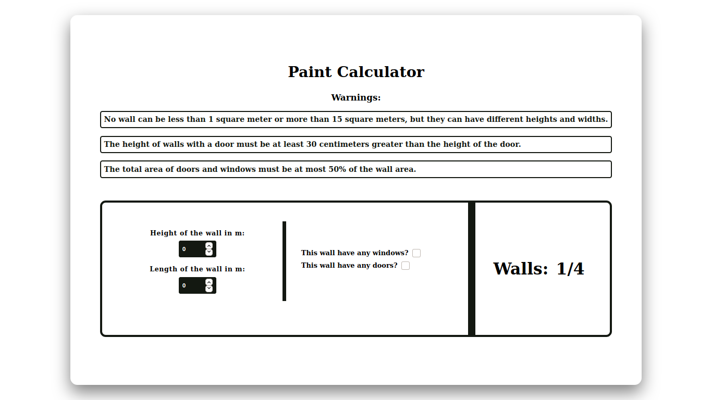
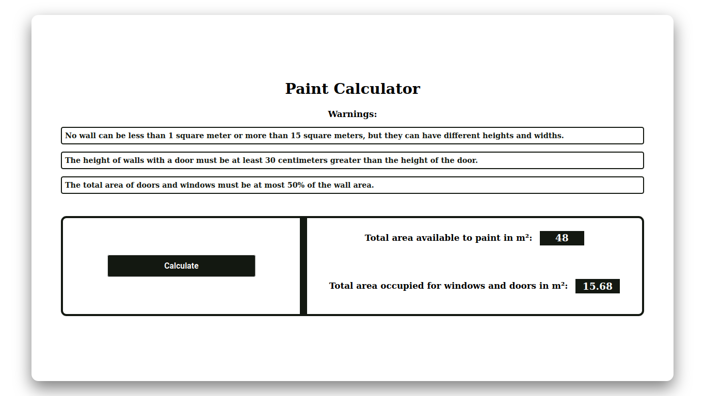
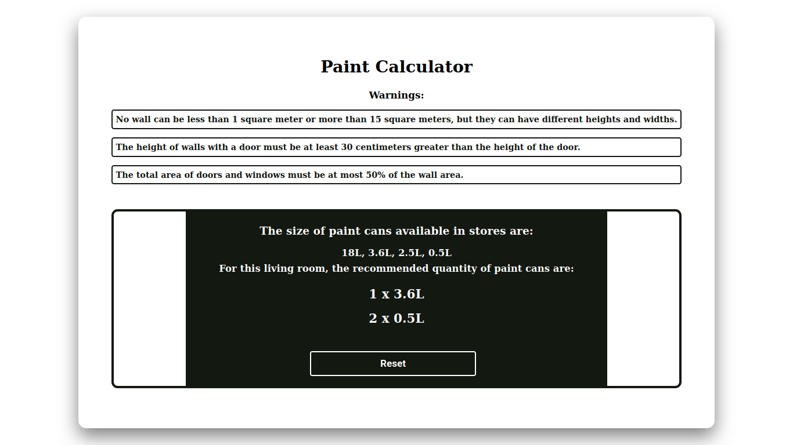

<h1>Welcome to PaintCalculator! </h1>

<h3>The purpose of this application is to calculate how many paint cans will be needed to paint a room with 4 walls.</h3>

OBS: The size of the windows and doors is already defined.

    - Window : 2.00 x 1.20 meter
    - Door : 0.80 x 1.90 meter

<h3>
    To run in your machine you'll need:
</h3>

<ul>

<li>Git installed on the machine. <a href="https://git-scm.com/downloads">Download git</a></li>

<li>Yarn installed on the machine.
    <a href="https://classic.yarnpkg.com/lang/en/docs/install/#debian-stable">Download yarn</a>
</li>

</ul>

<ol>

<li style="margin-top:1rem">
    Open 2 terminals. One for the file folder "client" and other for "server".
</li>

<li>
    On each terminal you'll run the comand <code>yarn</code>
</li>

<li>
    On the server terminal you'll run the next comand: <code>yarn dev</code>
</li>

<li>
    On the client terminal you'll run the next comand: <code>yarn start</code>
</li>

<li>
    If you want to see server's documentation, when the server is up, go to the browser and type: <code>http://localhost:3333/api-docs</code>
</li>

</ol>

